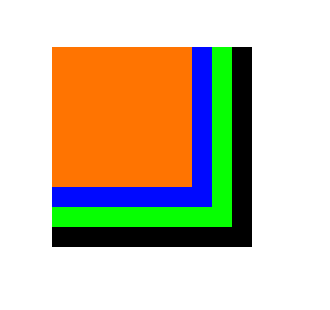

# UIView-Frame
UIView+Positioning is a Objective-C Extension which provides easy shorthand methods to defining the frame properties (width, height, x, y) of any UIView based object in an easy fashion, as well as extra helpful properties and methods.

#USAGE

```
UIView *view1 = [UIView new];
UIView *view2 = [UIView new];
UIView *view3 = [UIView new];
UIView *view4 = [UIView new];

view1.backgroundColor = [UIColor blackColor];
view2.backgroundColor = [UIColor greenColor];
view3.backgroundColor = [UIColor blueColor];
view4.backgroundColor = [UIColor orangeColor];

view1.viewSize   = CGSizeMake(200, 200);
view1.viewOrigin = CGPointMake(100, 100);

view2.viewSize   = CGSizeMake(180, 180);
view2.x          = 100;
view2.y          = 100;

view3.viewSize   = CGSizeMake(160, 160);
view3.center     = CGPointMake(180, 180);

view4.viewSize   = CGSizeMake(140, 140);
view4.top        = 100;
view4.left       = 100;

[self.view addSubview:view1];
[self.view addSubview:view2];
[self.view addSubview:view3];
[self.view addSubview:view4];
```

run in this:


# AVAILABLE PROPERTIES & METHODS
- x, y, viewOrigin - Positioning Shorthand
- width, height, viewSize - Sizing Shorthand
- left, bottom, top, right - Representing X and Y values of the different sides of the view
- centerX, centerY - Shorthand for the X and Y of the View's Center
- middleX, middleY, middlePoint - Center the current view relatively to self, if one exists
